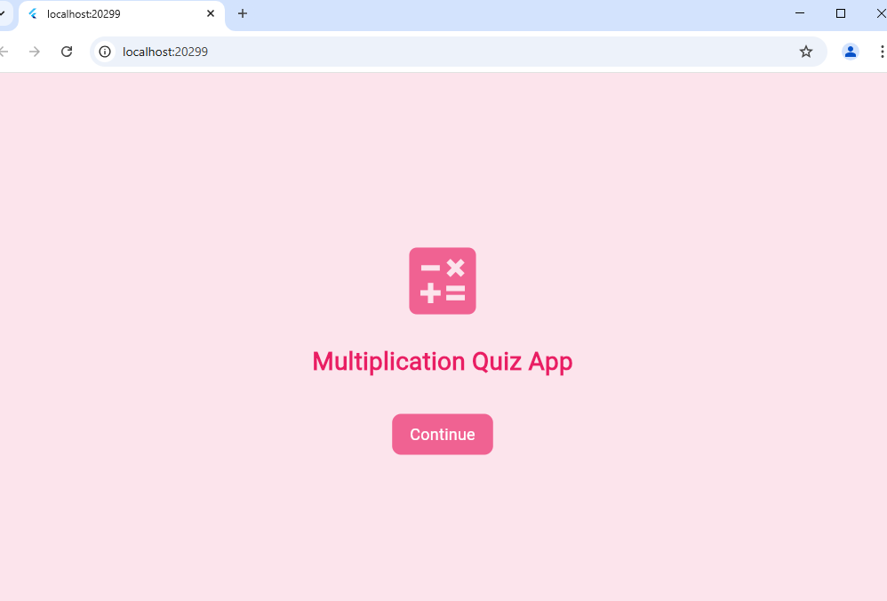

# 🎯 Multiplication Quiz App 🎲  

A fun and interactive **Flutter** app for mastering multiplication tables! It features **quiz & practice modes**, customizable settings, and a **visually appealing pink-themed UI**.  

## 🌟 Features  

- 🏠 **Home Screen** – Simple UI with a 🎛️ "Continue" button for quick access.  
- 🏆 **Quiz Mode** – Customize tables (1-20), set question limits (5-20), enable ⏳ timers (5-30 sec), and track scores in real-time.  
- 🔢 **Practice Mode** – Get random multiplication questions, receive ✅ instant feedback, and manually refresh questions.  
- ⚙️ **Custom Settings** – Adjust font size ✏️ and personalize the theme 🎨.  
- 📊 **Result Screen** – View your final score 📈 and easily navigate back.  

🚀 **Make learning multiplication fun & engaging!** 🎉

