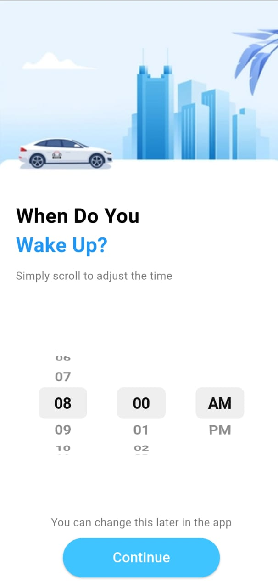
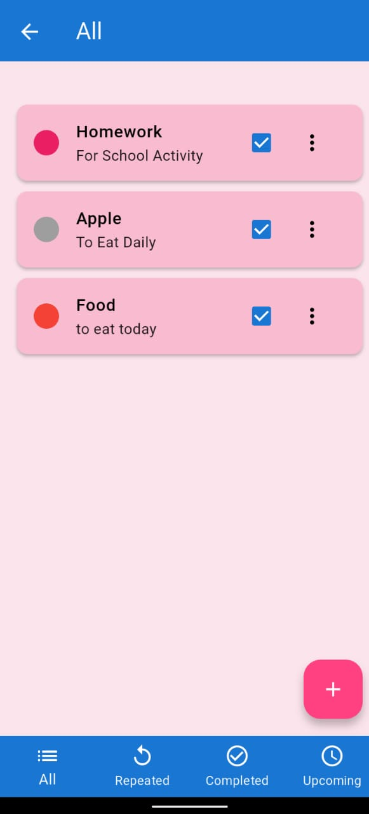
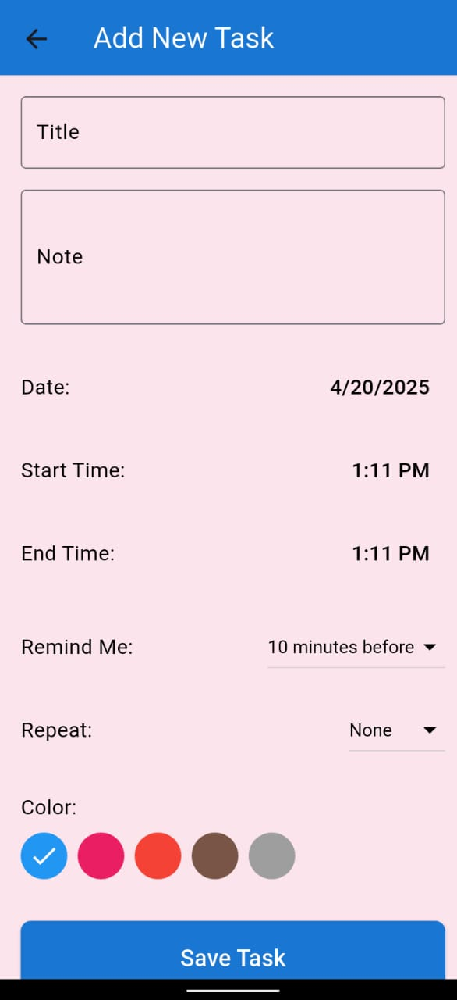
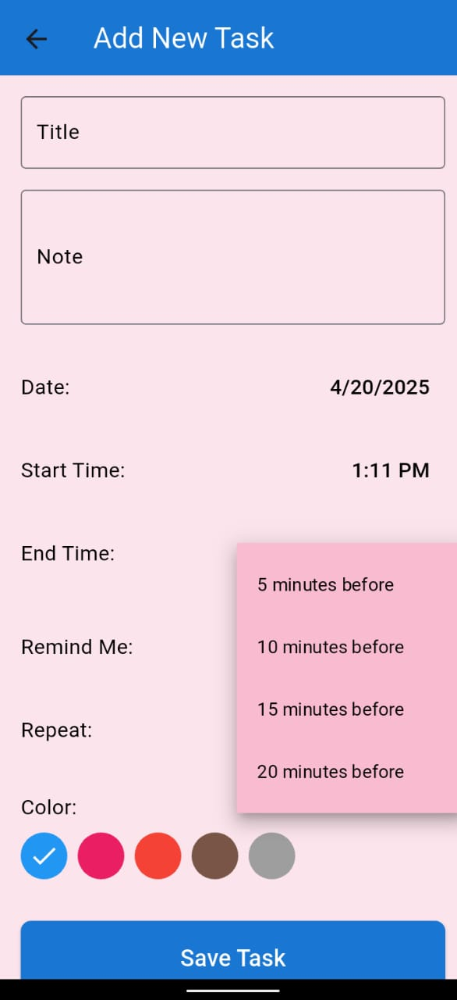
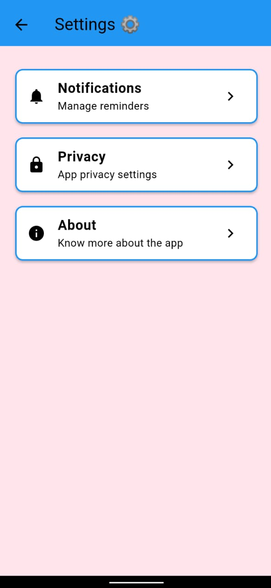

### 🌟 **Todo – Smart Task Manager for Your Daily Life** 🌟  
**📝 Plan. 🕒 Manage. 📈 Achieve.**

**Todo** is your all-in-one daily task planner designed to help you stay organized, focused, and in control of your routine.

---

### 🔑 **Key Features**:

🛌 **Sleep & Wake-Up Time** – Set your personalized sleep and wake-up schedule  
📅 **Home Dashboard** – View all your tasks & calendar in one smart view  
🗂️ **Task Management** – Add, edit & organize your daily tasks effortlessly  
📤 **Download Report** – Export your daily task report in one click  
🔔 **Custom Notifications** – Enable or disable reminders as per your preference  
⚙️ **Settings Control** – Manage privacy, app preferences & more  
🔒 **Privacy First** – Your data is secure with our built-in privacy features  
🎥 **Demo Video** – See how smoothly Todo fits into your life  

---

✅ **Todo is built for simplicity, control, and productivity.**  
Whether you're a student, a professional, or anyone who wants better control of their time—**Todo is your smart daily companion.**

The Welcome Screen  

The user can set their own sleep time.

The user can set their own wake up time. 

Home screen where calender timings & all completed tasks will appear. 

User Can Manage Their Task.

User Can Manage Their Task.

User Can Manage Their Task.

User Can Manage Their Task.

User can Add their task there.

User can download their daily task report. 

   

User Can manage settings.

User can enable or disable notifications for app.

Our Privacy Concerns

About my App 

https://github.com/user-attachments/assets/891886f3-2995-49e6-beeb-d6114425128d

