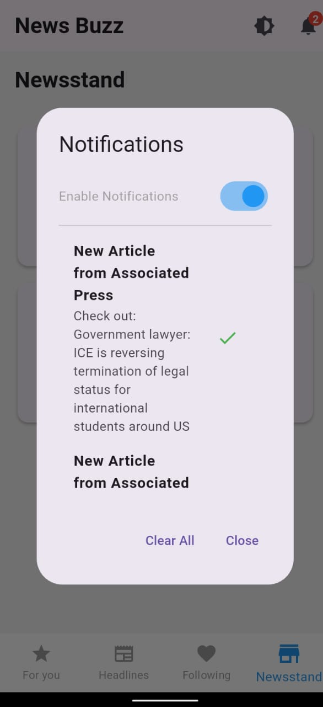
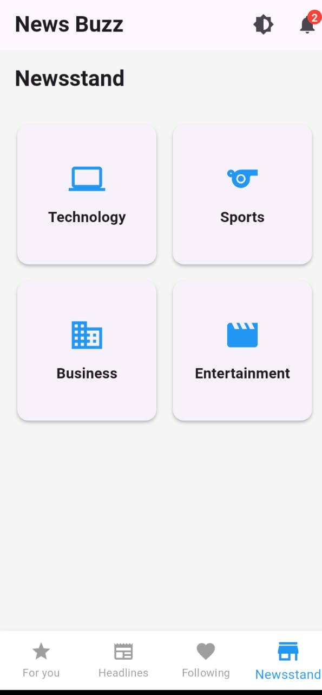
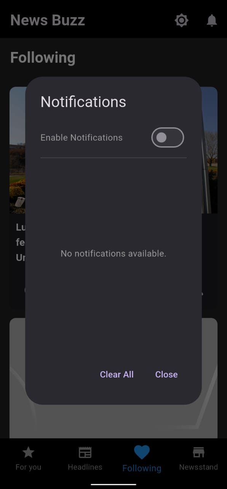

📱 News Buzz 

News Buzz is a fast and modern news application that fetches real-time news from APIs.
Users can explore the latest headlines, follow topics, like and favorite articles, receive breaking news notifications, and enjoy both light and dark themes.

Sharing news with friends is just one tap away!

🔥 Key Features:

✨ Real-time News Updates

🔗 Fetch latest news articles directly from live APIs.

📰 Multiple News Categories

📚 Browse news from Politics, Sports, Technology, Entertainment, and more.

❤️ Like Articles

👥 Follow Topics and Sources

🔔 Stay updated with news from your favorite topics and publishers.

📢 Push Notifications

🔔 Get instant alerts for breaking news and important updates.

📤 Share News Easily

📱 Share articles with friends via WhatsApp, Facebook, Instagram, and more.

🎨 Light and Dark Themes

🌞🌙 Switch between light and dark mode for comfortable reading anytime.

🎯 Summary:
News Buzz gives you the latest news at your fingertips with a modern design, real-time updates, and full control over your reading experience!

.jpeg>)

<video controls src="Demo (2).mp4" title="Demo"></video>
